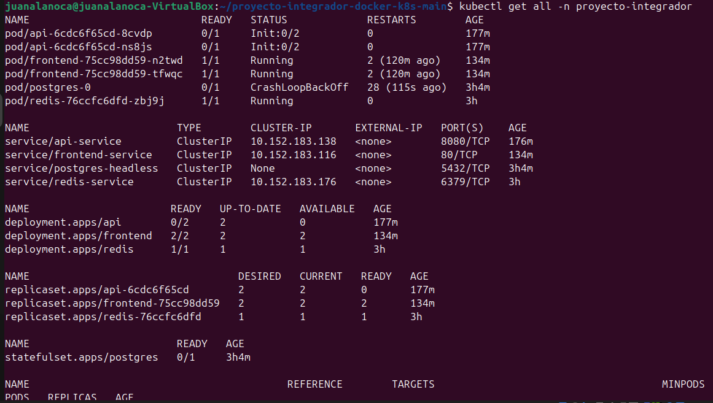
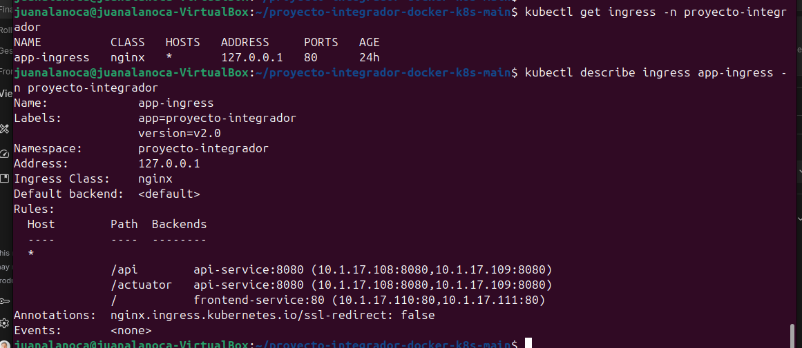

# Proyecto Final - Docker & Kubernetes

**Alumno:** JUAN CARLOS ALANOCA TICONA
**Fecha:** 31/10/2025
**Curso:** Docker & Kubernetes - i-Quattro

## Links de Docker Hub
- Backend v2.1: https://hub.docker.com/r/juanalanoca/springboot-api/tags
- Frontend v2.2: https://hub.docker.com/r/juanalanoca/angular-frontend/tags

## Parte 1: Setup del Ambiente

**Ambiente utilizado:**
- VirtualBox
- Nombre de VM/Instancia: juan-alanoca-k8
- Sistema operativo: Ubuntu (64-bit)
- Recursos: 4GB RAM, 2 CPU cores
- Red configurada:(13)I219-LM Intel
- Rango MetalLB: 10.241.2.240-10.241.2.250

### Screenshots
**configuracion maquina virtual:**


**microk8s status:**


**configuracion HPA para backend:**


**kubectl version:**


**configurar MetalLB:**


**Estado de todos los recursos:**


**ingress routing HTTP:**


**Proyecto Integrado Springboot:**


**Probando Funcionalidad:**


## Parte 2: Backend v2.1
**se edita el archivo controller con el siguiente codigo**
```java
@GetMapping("/api/info")
public ResponseEntity<Map<String, Object>> getInfo() {
    Map<String, Object> info = new HashMap<>();
    info.put("alumno", "TU NOMBRE COMPLETO");
    info.put("version", "v2.1");
    info.put("curso", "Docker & Kubernetes - i-Quattro");
    info.put("timestamp", LocalDateTime.now().toString());
    info.put("hostname", System.getenv("HOSTNAME"));
    return ResponseEntity.ok(info);
}
```

### Código Agregado

### Screenshots
**Cambio nuevo end point:**


**aplicar cambios:**


**crearcion de imagen:**


**pods actualizandoce:**


**prueba curl json:**


**publicar imagen en Docker:**


**verifica imagen en la web Docker HUB:**


## Parte 3: Frontend v2.2
#### 3.1 Modificar Frontend Angular
Agregar funcionalidad en el frontend para consumir el nuevo endpoint `/api/info`, versionar como v2.2 y desplegar.

### Screenshots

**modificando componente TS:**


**modificando componente HTML:**


**`kubectl get pods -w` durante el rolling update del frontend**


**IMAGEN EN DOCKER HUB- VER BOTON E INFORMACION DEL SISTEMA:**


**VERIFICANDO CAMBIO A V2.2 EN DOCKER HUB:**


## Parte 4: Gestión de Versiones

### ¿Qué hace kubectl rollout undo?

kubectl rollout undo es un comando crucial para la gestión de versiones y la recuperación de desastres en Kubernetes. Permite revertir una implementación (deployment) a una revisión anterior de forma rápida y segura. Cuando un nuevo despliegue causa problemas, rollout undo desactiva la versión problemática y vuelve a desplegar una versión estable previa. Esto se logra manteniendo el historial de revisiones del deployment. Por ejemplo, si la versión actual es la 3 y hubo problemas, rollout undo la revertirá a la versión 2 , EN MI CASO A LA 6.


### Screenshots

**rollout history backend:**


**rollout history frontend:**


**proceso de rollback (undo)**


**rollforward (undo --to-revision=2)**


**verificando que `/api/info` volvió a funcionar**


**verificando que `/api/info`**


## Parte 5: Ingress + MetalLB

**IP del Ingress:**
### Screenshots

**mostrando ip asignada y mostrando rutas configuradas**


**mostrando navegador accediendo (FRONTEND)**


**mostrando navegador accediendo (FRONTEND)**


**mostrando CURL ACTUADOR HEALTH**


**IP del Ingress**


## Conclusiones
### Aprendizajes principales
Comprensión profunda del ciclo de vida de una aplicación con Docker y Kubernetes, desde la creación de imágenes hasta el despliegue en un cluster.
Habilidad para orquestar contenedores utilizando manifiestos de Kubernetes, incluyendo Deployments, Services, ConfigMaps y Secrets.
Manejo de herramientas clave como kubectl, microk8s y la integración con Docker Hub.
Implementación y gestión de Ingress para exponer servicios externamente de forma eficiente.

### Dificultades encontradas
Configuración inicial de MetalLB en MicroK8s: Tuve problemas para definir el rango de IPs correcto y que el servicio de MetalLB reconociera los IPs disponibles. Lo resolví revisando la documentación de MicroK8s y ajustando el ConfigMap de MetalLB hasta que los Load Balancers obtuvieron IPs.
Depuración de manifiestos de Kubernetes: Errores sutiles en la sintaxis YAML o en la referencia de nombres me causaron frustración. La resolví usando kubectl describe y kubectl logs para obtener más detalles y el validador YAML en mi editor de código.


### Reflexión
Este proyecto me ha proporcionado una base sólida para entender cómo las aplicaciones modernas se construyen, empaquetan y despliegan a escala. Aplicaría esto en un proyecto real para asegurar despliegues consistentes y escalables, utilizando CI/CD para automatizar las actualizaciones y rollbacks. Es fundamental para la entrega continua y la resiliencia de la infraestructura.


